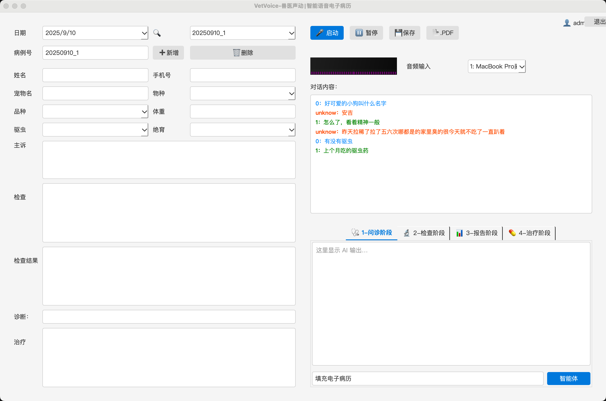
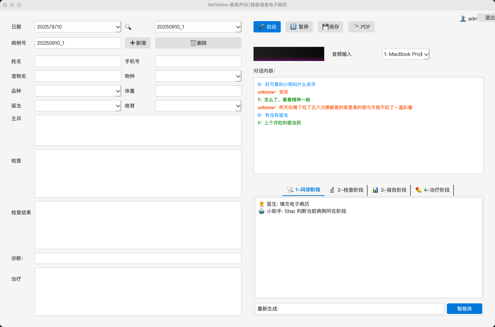
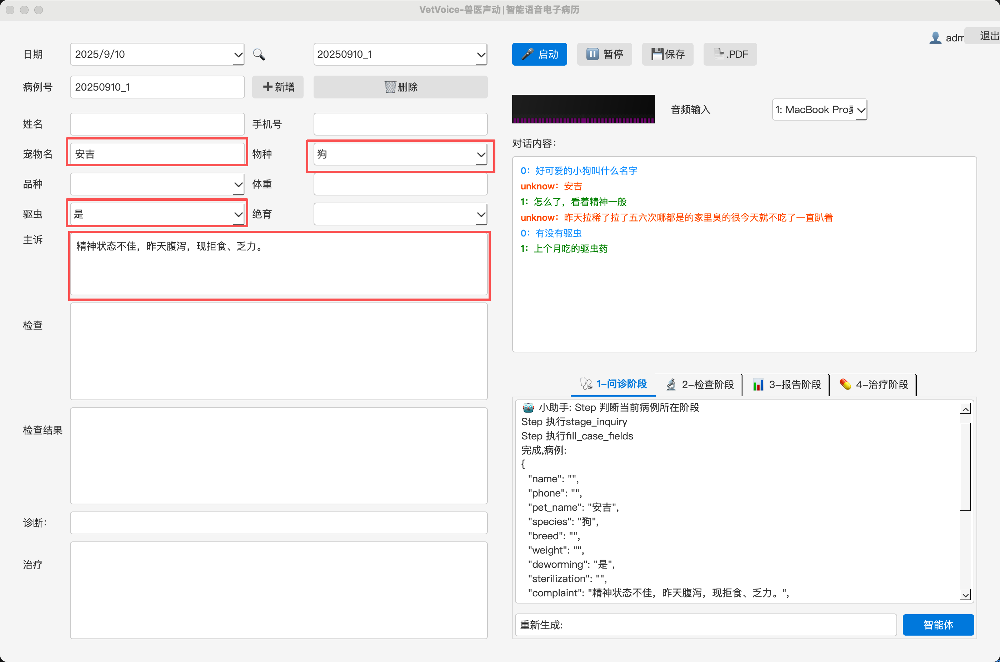

# 🩺 ​​VetVoice | 兽医声动

<div align="center">
  <div style="background: linear-gradient(135deg, #667eea 0%, #764ba2 100%); border-radius: 15px; padding: 25px; text-align: center;">
    <p style="font-size: 48px;" >兽医声动，诊疗更高效</p>
  </div>
</div>

</div>

<div align="center" style="margin: 30px 0;">
  
</div>


# 展示

## agent智能填充

|  |  |  |
|----------------------|----------------------|----------------------|
| 实时语音识别                | 开始agent                | 对话填充电子病历                |

# 🎉 新闻
- [X] [2025.09.10]🎯📢 支持agent/mcp智能体，智能整理电子病历4个阶段：问诊阶段 / 开检查阶段 / 查看检查结果阶段 / 确诊治疗阶段。
- [X] [2025.08.26]🎊🔥 基于Python3.10版发布🔥🎊
# 简介
  VetVoice（兽医声动）​​ 是基于 ​PySide6 + FunASR + LLM​ 的智能语音病历系统跨平台【插件】，搭配【全向会议麦克风】，成为宠物医疗病例强力助手。支持：

  - 实时语音降噪
  - 实时语音转文字（中英文）
  - 自动区分医生/宠主对话
  - 大模型辅助生成病例、诊断建议
  - 一键导出PDF/WAV
  - 适用于宠物医院、兽医诊所等场景，解决手写病历效率低下的痛点。
  - 开放http/mcp_server可方便集成


# 核心功能
## 实时语音降噪
  - 基于 Webrtc实时降噪（配合全向会议麦克风最佳）
## 实时语音识别
  - 基于 [FunASR](https://github.com/modelscope/FunASR) / [Vosk](https://github.com/alphacep/vosk-api)，支持长语音断句和静音检测
  - 自适应降噪，提升嘈杂环境下的识别准确率
## 实时说话人分离
  - 自动标记医生与宠主对话（不同颜色/对齐方式）
  - 支持多人对话场景
## 实时大模型辅助诊疗

  - ​病例生成​：语音输入→结构化病历（主诉、现病史等）
  - ​辅助诊断​：大模型分析对话，提供鉴别诊断建议
  - ​用药指导​：自动生成用法用量（需接入大模型API）

## 一键导出

  - 保存原始音频文件（WAV格式）,批量导出PDF病历


# 下载

 > ​通过网盘分享的文件：resources.zip

 >​ 链接: https://pan.baidu.com/s/1arQO6OBExGB3xlq4zykvvw?pwd=6847 提取码: 6847

 >​ 下载解压到本地，如：/data/resources

 >​ 在登陆页面设置资源路径：/data/resources

# 使用
  Python3.10环境启动(推荐3.10，Pyside6对高版本Python支持不友好)
``` bash
git clone https://github.com/georgewangchn/VetVoice.git
cd VetVoice
uv venv --python=3.10
source .venv/bin/activate
uv pip install torch==2.2.0 torchvision==0.17.0 torchaudio==2.2.0 --index-url https://download.pytorch.org/whl/cpu
uv sync # or uv pip install -r requirements.txt
python main.py
```
## 窗口程序使用步骤
  - 注册
  - 登陆（用户名、密码、资源路径、保存路径）
  - 设置 大模型openai形式接口参数）
  - 重启
  - 开始使用
# TODO计划
  - pyinstaller打包windows/ubuntu/macos平台安装包
  - 开放http/mcp控制接口：当前病例号/开始录音/停止录音/辅诊/检查确诊/推荐用药/电子病历等
  - [x] 采用fastmcp开发对话mcp，电子病历流程从人控制转向agent控制（开发测试使用模型：gpt-5-nano）
  - 推荐用户分享样本训练模型提升效果
  - 性能优化

# 致谢
  感谢以下优秀开源项目的支持：

  - [FunASR](https://github.com/modelscope/FunASR)

  - [pyannote-audio](https://github.com/pyannote/pyannote-audio)

  - [py-xiaozhi](https://github.com/huangjunsen0406/py-xiaozhi)


# Apache License 2.0
  [LICENSE](LICENSE)

  VetVoice 还包含多种第三方组件及从其他代码库修改而来的部分代码（这些内容遵循其他开源许可证）。
  预训练模型的使用需遵守相应模型的许可证要求。

## Star History

[](https://www.star-history.com/#georgewangchn/VetVoice.git&Date)