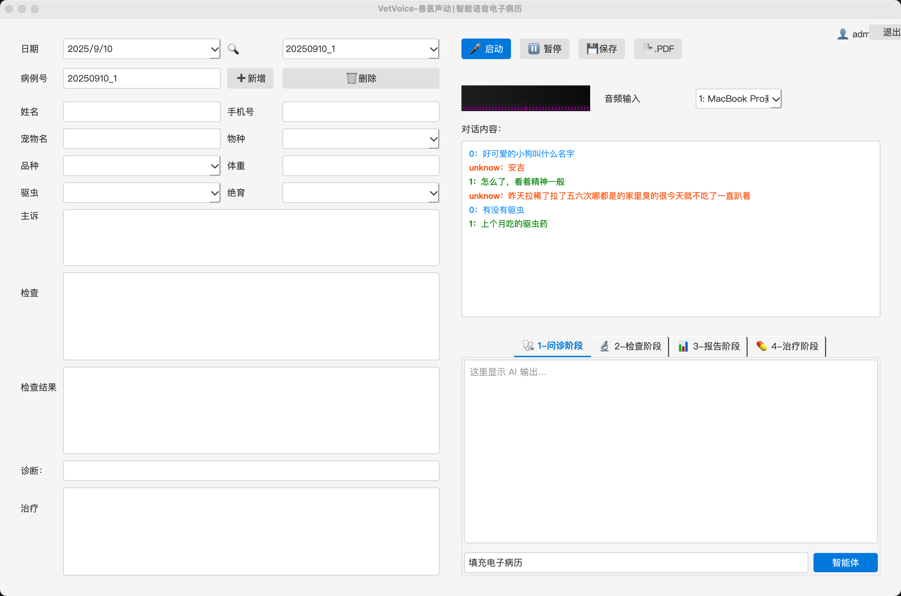
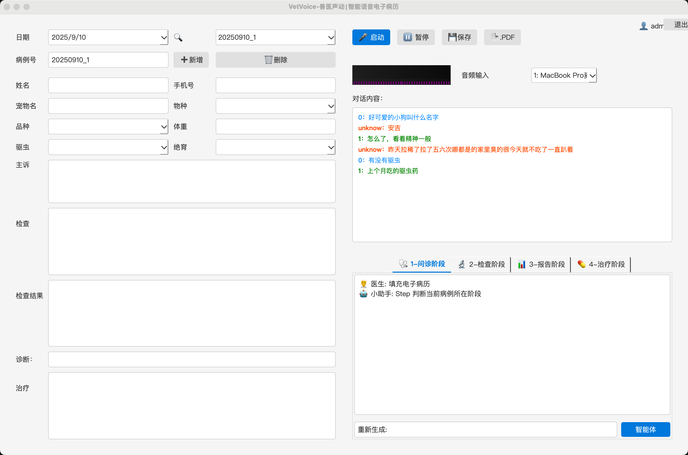
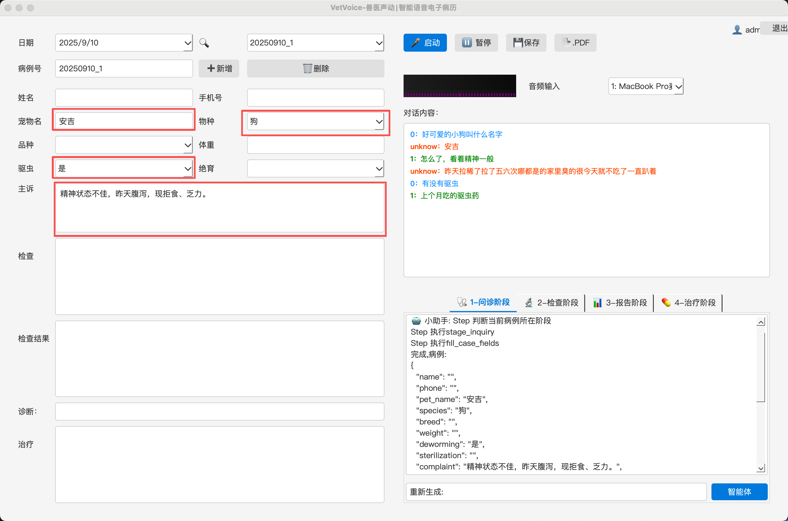

# 🩺 ​​VetVoice | 兽医声动

<div align="center">
  <div style="background: linear-gradient(135deg, #667eea 0%, #764ba2 100%); border-radius: 15px; padding: 25px; text-align: center;">
    <p style="font-size: 48px;" >兽医声动，诊疗更高效</p>
  </div>
</div>

</div>

<div align="center" style="margin: 30px 0;">
  
</div>


# 展示

## agent智能填充

|  |  |  |
|----------------------|----------------------|----------------------|
| 实时语音识别                | 开始agent                | 对话填充电子病历                |

# 🎉 新闻
- [X] [2026.04.02]🎯📢 模型自动下载。
- [X] [2025.09.10]🎯📢 支持agent/mcp智能体，智能整理电子病历4个阶段：问诊阶段 / 开检查阶段 / 查看检查结果阶段 / 确诊治疗阶段。
- [X] [2025.08.26]🎊🔥 基于Python3.10版发布🔥🎊
# 简介
  VetVoice（兽医声动）​​ 是基于 ​PySide6 + FunASR + LLM​ 的智能语音病历系统跨平台【插件】，搭配【全向会议麦克风】，成为宠物医疗病例强力助手。支持：

  - 实时语音降噪
  - 实时语音转文字（中英文）
  - 自动区分医生/宠主对话
  - 大模型辅助生成病例、诊断建议
  - 一键导出PDF/WAV
  - 适用于宠物医院、兽医诊所等场景，解决手写病历效率低下的痛点。
  - 开放http/mcp_server可方便集成


# 核心功能
## 实时语音降噪
  - 基于 Webrtc实时降噪（配合全向会议麦克风最佳）
## 实时语音识别
  - 基于 [FunASR](https://github.com/modelscope/FunASR) / [Vosk](https://github.com/alphacep/vosk-api)，支持长语音断句和静音检测
  - 自适应降噪，提升嘈杂环境下的识别准确率
## 实时说话人分离
  - 自动标记医生与宠主对话（不同颜色/对齐方式）
  - 支持多人对话场景
## 实时大模型辅助诊疗

  - ​病例生成​：语音输入→结构化病历（主诉、现病史等）
  - ​辅助诊断​：大模型分析对话，提供鉴别诊断建议
  - ​用药指导​：自动生成用法用量（需接入大模型API）

## 一键导出

  - 保存原始音频文件（WAV格式）,批量导出PDF病历


# 下载

**模型自动下载**（推荐）
- 系统首次启动时会自动下载所需模型文件，无需手动下载
- 支持断点续传，下载过程中可随时暂停和恢复
- 模型文件将自动保存在程序指定的资源目录中

**手动下载（可选）**
``` bash
pip install modelscope
modelscope download --model shuai1618/wespeaker-voxceleb-resnet34-LM
modelscope download --model shuai1618/paraformer-zh-streaming
```

# 使用

## 环境要求
- **Python 3.10**（推荐3.10，Pyside6对高版本Python支持不友好）
- 支持系统：Windows / macOS / Linux
- 硬件要求：建议至少4GB内存用于模型加载

## 安装步骤

### 1. 克隆代码仓库
```bash
git clone https://github.com/georgewangchn/VetVoice.git
cd VetVoice
```

### 2. 启动程序
```bash
python main.py
```

## 窗口程序使用步骤

### 首次使用配置

#### 1. 用户注册
- 启动程序后进入注册页面
- 填写用户名和密码完成注册

#### 2. 登录设置
- 使用注册的账号登录
- **资源路径设置**：指定模型文件保存目录（建议选择有足够空间的磁盘）
- **保存路径设置**：指定录制的音频和导出病历的保存目录

#### 3. 模型自动下载
- 系统首次启动时会自动检测所需模型
- 如发现模型不存在，会自动开始下载过程
- **支持的模型**：
  - 语音识别模型（paraformer-zh-streaming）
  - 说话人识别模型（wespeaker-voxceleb-resnet34-LM）
- 下载过程支持断点续传，可随时暂停和恢复
- 下载完成后模型自动保存到指定的资源路径

#### 4. 大模型参数设置
- 进入参数页面配置LLM接口
- **支持格式**：OpenAI兼容API格式
- **必需参数**：
  - API地址（如：https://api.openai.com/v1）
  - API密钥（填写相应的服务密钥）
- **可选参数**：
  - 模型名称（如：gpt-4, gpt-3.5-turbo等）
  - 温度参数（控制生成随机性）

#### 5. 重启程序
- 配置完成后需重启程序使设置生效
- 模型下载完成后重启即可开始使用

### 日常使用流程

#### 开始诊疗
1. 登录系统
2. 点击"开始录音"按钮
3. 对话过程中系统实时：
   - 语音降噪处理
   - 语音转文字
   - 自动识别说话人（医生/宠主）
4. 点击"停止录音"结束

#### 辅助诊断
1. 点击"开始agent"启动AI辅助
2. 系统智能整理电子病历，支持4个阶段：
   - 问诊阶段
   - 开检查阶段
   - 查看检查结果阶段
   - 确诊治疗阶段
3. AI根据对话内容自动填充病历结构化信息

#### 导出保存
1. 查看/编辑生成的病历内容
2. 点击导出按钮保存为PDF格式
3. 原始录音文件自动保存为WAV格式

## 注意事项
- 首次启动模型下载需要稳定网络环境
- 建议使用全向会议麦克风以获得最佳降噪效果
- 大模型调用消耗API调用次数，请根据实际需求配置
# TODO计划
  - pyinstaller打包windows/ubuntu/macos平台安装包
  - 开放http/mcp控制接口：当前病例号/开始录音/停止录音/辅诊/检查确诊/推荐用药/电子病历等
  - [x] 采用fastmcp开发对话mcp，电子病历流程从人控制转向agent控制（开发测试使用模型：gpt-5-nano）
  - 推荐用户分享样本训练模型提升效果
  - 性能优化

# 致谢
  感谢以下优秀开源项目的支持：

  - [FunASR](https://github.com/modelscope/FunASR)

  - [pyannote-audio](https://github.com/pyannote/pyannote-audio)

  - [py-xiaozhi](https://github.com/huangjunsen0406/py-xiaozhi)


# Apache License 2.0
  [LICENSE](LICENSE)

  VetVoice 还包含多种第三方组件及从其他代码库修改而来的部分代码（这些内容遵循其他开源许可证）。
  预训练模型的使用需遵守相应模型的许可证要求。

## Star History

[](https://www.star-history.com/#georgewangchn/VetVoice.git&Date)